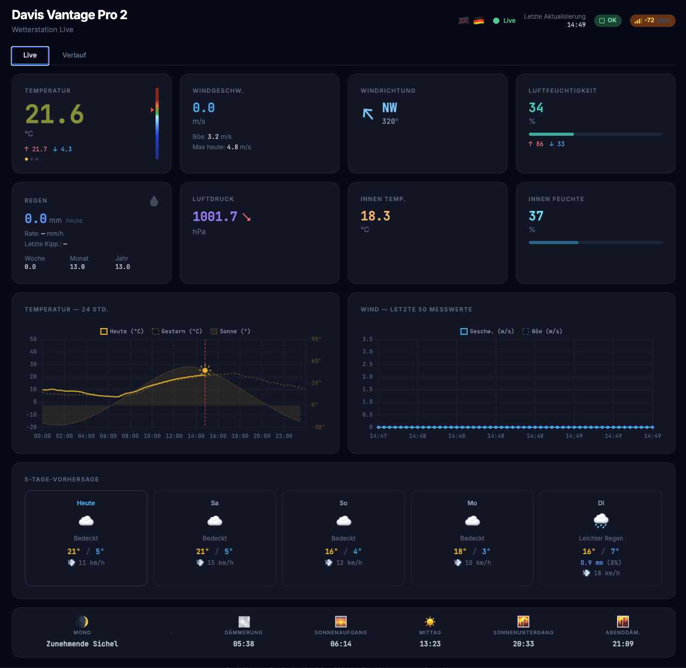
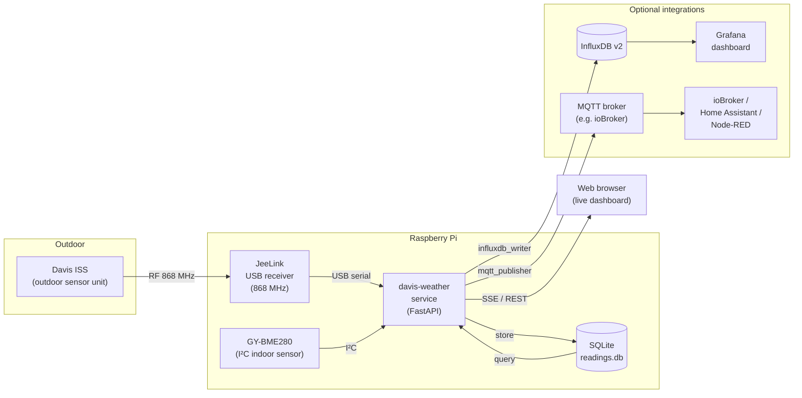

# jeelink-davis

Python library and live web dashboard for **Davis Vantage Pro 2** weather station data received via a **JeeLink USB receiver**.

The JeeLink must be flashed with Davis firmware 0.8e (RFM69, EU 868 MHz). The library auto-detects the JeeLink by USB VID/PID so it works without configuration on macOS, Raspberry Pi, etc.

## Dashboard

The bundled web dashboard (`web/`) is a single-page app served via FastAPI:

- **Live cards** — outdoor temperature (clickable to cycle through dew point and wind chill), wind speed/direction, humidity, rain rate, barometric pressure with rising/falling/steady trend, indoor temperature and indoor humidity
- **Signal badge** — RSSI shown as a colour-coded badge in the header alongside battery status
- **24-hour temperature chart** — rolling today/yesterday overlay with sun elevation curve and a "now" marker
- **Wind chart** — rolling last 50 readings (speed + gust)
- **Historical data browser** — 1D / 7D / 1M / 1Y and custom date range with auto-bucketed charts (5 min → 1 h → 6 h → daily) and metric tabs (temperature, rain, wind, humidity)
- **5-day forecast** — via Open-Meteo (cached 30 min)
- **Sun & moon strip** — dawn, sunrise, noon, sunset, dusk, moon phase
- **EN / DE** — language toggle, persisted in localStorage



## Architecture



### Indoor sensor (GY-BME280)

A GY-BME280 connected to the Raspberry Pi I²C bus provides barometric pressure, indoor temperature, and indoor humidity. The I²C address and bus number are configured in `config.toml` (defaults: bus `1`, address `0x76`). It is polled every 60 s by a background thread and stored in a separate `indoor_readings` SQLite table. Pressure trend compares the average of the last 30 min against the average of the 2–4 h ago window — effectively a 3-hour rolling comparison (±0.5 hPa threshold → rising / falling / steady).

## Requirements

- Python 3.11+
- JeeLink USB receiver with Davis firmware 0.8e
- Davis Vantage Pro 2 ISS (outdoor sensor unit)
- *(optional)* GY-BME280 on I²C (address and bus configurable in `config.toml`) for pressure and indoor climate

## Installation

```bash
python3 -m venv .venv
source .venv/bin/activate
pip install -e .              # library only
pip install -e ".[web]"       # library + web dashboard dependencies (includes smbus2, RPi.bme280)
pip install -e ".[dev]"       # library + test dependencies
```

## Configuration

A vanilla `config.toml.example` is already in the project root — copy it to `config.toml` and edit that copy to match your location and hardware before running the web service. Note that both the `[influxdb]` and `[mqtt]` sections are optional. If you'd like to use either of them or both just uncomment what you need and edit the settings according to your environment:

```toml
[station]
name      = "Davis Vantage Pro 2"
latitude  = 51.500000   # decimal degrees, positive = North
longitude = 0.000000    # decimal degrees, positive = East
elevation = 50          # metres above sea level
timezone  = "Europe/London"

[storage]
db_path = "data/readings.db"   # relative to project root, or absolute path

[sensors]
bme280_bus     = 1     # I²C bus number (1 on all modern Raspberry Pi models)
bme280_address = 0x76  # I²C address: 0x76 (SDO low) or 0x77 (SDO high)

# InfluxDB v2 export (optional — remove section to disable)
# Token: set via INFLUXDB_TOKEN env var (preferred) or token key below.
# [influxdb]
# url    = "http://192.168.1.100:8086"
# org    = "My Home"
# bucket = "weather"
# token  = "paste-token-here-or-use-INFLUXDB_TOKEN-env-var"

# MQTT export (optional — remove section to disable)
# Password: set via MQTT_PASSWORD env var (preferred) or password key below.
# [mqtt]
# host     = "192.168.1.100"
# port     = 1883
# username = "your-username"
# password = "paste-password-here-or-use-MQTT_PASSWORD-env-var"
```

| Key | Description |
|---|---|
| `station.latitude` / `longitude` | Used for the Open-Meteo forecast and sun elevation/times. |
| `station.elevation` | Metres above sea level — passed to Open-Meteo. |
| `station.timezone` | IANA timezone name, e.g. `Europe/Berlin`. Controls daily stats boundaries and chart x-axis. |
| `storage.db_path` | SQLite database path. Relative paths are resolved from the project root. |
| `sensors.bme280_address` | I²C address of the GY-BME280. Change to `0x77` if the SDO pin on your module is pulled high. |
| `sensors.bme280_bus` | I²C bus number. Almost always `1` on Raspberry Pi. |

The **JeeLink serial port** is auto-detected by USB VID/PID. Override it with the `DAVIS_PORT` environment variable if needed (e.g. when multiple USB serial devices are present). The **BME280** is optional — if `smbus2`/`RPi.bme280` are not installed or the sensor is unreachable, the indoor readings are simply disabled and the rest of the app is unaffected.

## Running the dashboard

### Development

```bash
.venv/bin/uvicorn web.app:app --host 0.0.0.0 --port 8000
# Override serial port if auto-detection picks the wrong device:
DAVIS_PORT=/dev/ttyUSB0 .venv/bin/uvicorn web.app:app --host 0.0.0.0 --port 8000
```

### Production deployment

The repo includes two helper scripts for deploying to a Linux host (e.g. a Raspberry Pi). Both must be run as root from the repository root on the target machine.

**First-time setup** — creates the `davis` system user, adds it to the `dialout` (JeeLink serial) and `i2c` (BME280) groups, copies the project to `/opt/jeelink-davis/`, installs dependencies in a venv, and installs + enables the `davis-weather` systemd service:

```bash
sudo ./deploy.sh
```

After the script finishes, edit `/opt/jeelink-davis/config.toml` to set your location, then restart the service:

```bash
sudo systemctl restart davis-weather
```

**Updating** — after pulling new commits, sync changed files and restart the service. `config.toml` and the SQLite database are never overwritten:

```bash
git pull
sudo ./update.sh
```

**Service management:**

```bash
sudo systemctl status davis-weather
sudo systemctl restart davis-weather
sudo journalctl -u davis-weather -f
```

## Library usage

```python
from jeelink_davis import DavisStation

with DavisStation() as station:        # auto-detects the JeeLink
    for reading in station.readings():
        print(f"{reading.timestamp}  "
              f"T={reading.temperature}  "
              f"H={reading.humidity}%  "
              f"Wind={reading.wind_speed} @ {reading.wind_direction}°  "
              f"RSSI={reading.rssi} dBm")
```

Pass `port=` explicitly if needed (e.g. multiple USB serial devices):

```python
with DavisStation(port="/dev/ttyUSB0") as station:
    ...
```

## Tools

```bash
# Detect JeeLink and report its port
.venv/bin/python tools/detect.py

# Raw listener — prints everything from the JeeLink for 60 seconds
.venv/bin/python tools/sniff.py
.venv/bin/python tools/sniff.py --duration 120
```

## Running tests

```bash
pip install -e ".[dev]"
.venv/bin/pytest tests/ -v
```

Tests do not require hardware — the serial port is fully mocked.

## Data model

`readings()` yields `WeatherReading` dataclass instances. All values are raw firmware values; unit conversion is left to the caller.

| Field | Sensor | Notes |
|---|---|---|
| `temperature` | Temperature | °C |
| `pressure` | Barometric pressure | hPa — always `None` for the Davis ISS (it has no barometer); dashboard pressure comes from the GY-BME280 via `/api/indoor` |
| `humidity` | Relative humidity | % |
| `wind_speed` | Wind speed | m/s |
| `wind_direction` | Wind direction | degrees 0–359 |
| `wind_gust` | Wind gust speed | m/s |
| `rain_tip_count` | Cumulative tip counter | 7-bit (0–127), wraps on overflow, resets on ISS power cycle; 1 tip = 0.2 mm (EU Davis) |
| `rain_secs` | Inter-tip interval | Seconds between the last two tips; sentinel < 0 = no rain; rain rate = 720 / rain_secs mm/h |
| `solar_radiation` | Solar radiation | W/m² |
| `uv_index` | UV index | |
| `voltage_solar` | Solar panel voltage | V |
| `voltage_capacitor` | Capacitor voltage | V |
| `rssi` | Signal strength | dBm |
| `battery_ok` | Battery status | `True` / `False` |
| `channel` | ISS channel | |
| `soil_temperature` | Soil temperature by zone | dict, zones 1–4 |
| `soil_moisture` | Soil moisture by zone | dict, zones 1–4 |
| `leaf_wetness` | Leaf wetness by zone | dict, zones 1–4 |

## Integrations

The core setup (JeeLink + Davis ISS + web dashboard) works without any external services. The following integrations are optional and documented separately:

| Integration | Guide | What it adds |
|---|---|---|
| **InfluxDB + Grafana** | [docs/influxdb-grafana.md](docs/influxdb-grafana.md) | Long-term storage, Grafana dashboard, hourly downsampling, host metrics via Telegraf |
| **MQTT / ioBroker** | [docs/mqtt-iobroker.md](docs/mqtt-iobroker.md) | Publishes live readings as retained MQTT topics; integrates with ioBroker, Home Assistant, Node-RED, etc. |

Both integrations are enabled by adding the corresponding section (`[influxdb]` or `[mqtt]`) to `config.toml`. Removing the section disables the integration entirely — no other changes required.

## AI-assisted development

This project was developed with the help of [Claude Code](https://claude.ai/code) (Anthropic). The architecture, protocol reverse-engineering, and integration work were done by the author; Claude assisted with implementation, documentation, and debugging throughout.

## License

MIT
