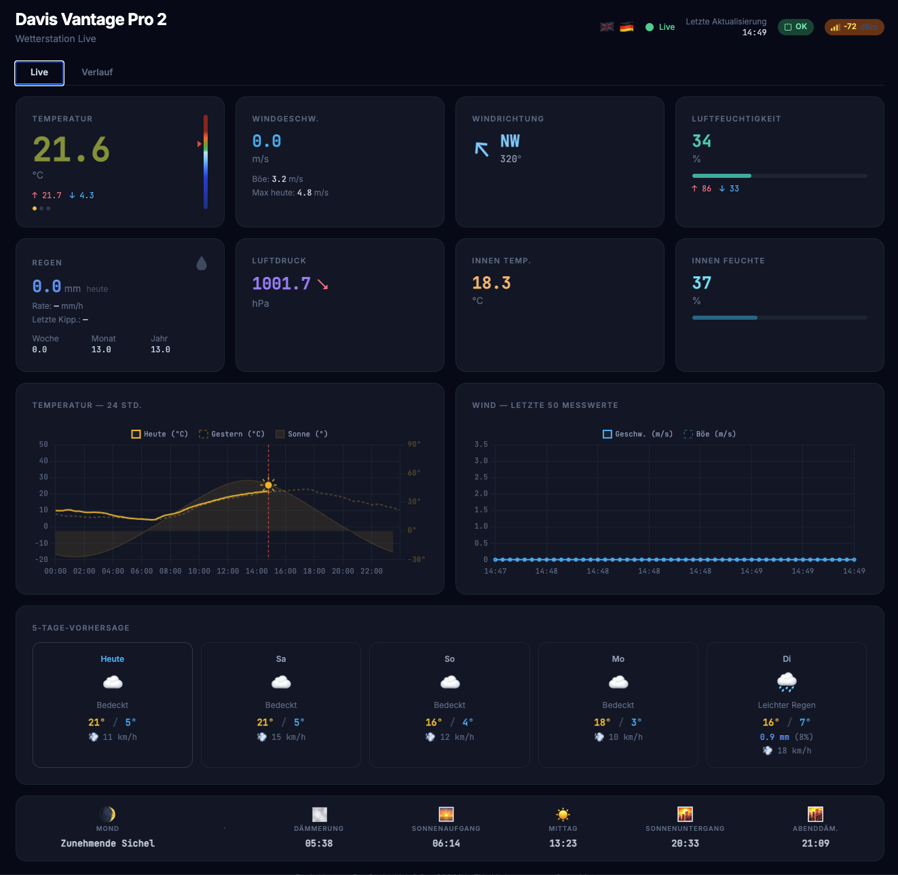
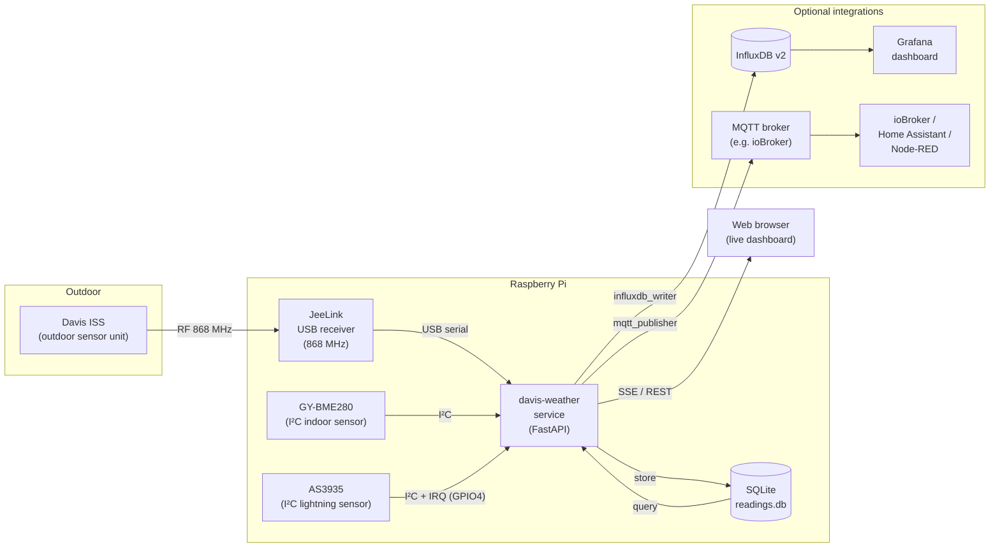

# jeelink-davis

Python library and live web dashboard for **Davis Vantage Pro 2** weather station data received via a **JeeLink USB receiver**.

The JeeLink must be flashed with Davis firmware 0.8e (RFM69, EU 868 MHz). The library auto-detects the JeeLink by USB VID/PID so it works without configuration on macOS, Raspberry Pi, etc.

## Dashboard

The bundled web dashboard (`web/`) is a single-page app served via FastAPI:

- **Live cards** — outdoor temperature (clickable to cycle through dew point and wind chill), wind speed/direction, humidity, rain rate, barometric pressure with rising/falling/steady trend, indoor temperature and indoor humidity
- **Signal badge** — RSSI shown as a colour-coded badge in the header alongside battery status
- **24-hour temperature chart** — rolling today/yesterday overlay with sun elevation curve and a "now" marker
- **Wind chart** — rolling last 50 readings (speed + gust)
- **Historical data browser** — 1D / 7D / 1M / 1Y and custom date range with auto-bucketed charts (5 min → 1 h → 6 h → daily) and metric tabs (temperature, rain, wind, humidity)
- **5-day forecast** — via Open-Meteo (cached 30 min)
- **Sun & moon strip** — dawn, sunrise, noon, sunset, dusk, moon phase
- **Rain radar** — animated DWD radar composite (last 60 min, 5-min steps) via Leaflet + DWD Open Data WMS; station marker, play/pause, scrubber, zoom-limited map
- **EN / DE** — language toggle, persisted in localStorage



### Touch console

A second front end at `/console/` is sized for a 1280×720 touch panel (the
official 7" Touch Display 2 mounted landscape): seven pages — now, rain, wind,
sun & moon, indoor, status, system — cycling every 15 seconds, with swipe and
tap-to-jump. It uses no external resources, so it keeps working with the
internet disconnected.

To run it full-screen on the machine itself, as an optional kiosk display:

```bash
sudo ./install-console.sh --lang en --rotate 90
```

This installs `labwc` (Wayland compositor), `chromium`, `seatd`, `curl`
(used by the service's startup readiness check) and `fonts-noto-color-emoji`
(so the Sun & moon page's sun/moon glyphs render instead of tofu boxes), and
enables `seatd.service` — a small seat-management daemon that lets the
service user reach the GPU and touch input without a login session or root.
It also adds the service user to group `video` (so `vcgencmd` can report
throttling) and to whichever group `seatd` created for seat access on that
system, configures the display rotation together with a matching libinput
touch calibration matrix (labwc does not rotate touch input along with the
output transform on its own), generates a fully transparent cursor theme (the
touch panel's controller also registers as a mouse, so the compositor would
otherwise leave a static cursor sitting in a corner of the screen), and
enables `weather-console.service`.
`deploy.sh` is unaffected — the kiosk is optional, touch hardware is not
assumed.

[](docs/console.md)

**[See all seven pages →](docs/console.md)** — photographed on the real panel,
with the reasoning behind the compass rose, the three needle states, and why
the console carries no external dependencies at all.

Design notes: `docs/specs/2026-07-25-touch-console-design.md`.

## Architecture


```mermaid
flowchart LR
    subgraph Outdoor
        ISS["Davis ISS\n(outdoor sensor unit)"]
    end

    subgraph Raspberry Pi
        JL["JeeLink\nUSB receiver\n(868 MHz)"]
        SVC["davis-weather\nservice\n(FastAPI)"]
        DB[("SQLite\nreadings.db")]
        BME["GY-BME280\n(I²C indoor sensor)"]
        AS["AS3935\n(I²C lightning sensor)"]
    end

    subgraph Optional integrations
        IDB[("InfluxDB v2")]
        GF["Grafana\ndashboard"]
        MQ["MQTT broker\n(e.g. ioBroker)"]
        IOB["ioBroker /\nHome Assistant /\nNode-RED"]
    end

    Browser["Web browser\n(live dashboard)"]

    ISS -- "RF 868 MHz" --> JL
    JL -- "USB serial" --> SVC
    BME -- "I²C" --> SVC
    AS -- "I²C + IRQ (GPIO4)" --> SVC
    SVC -- "store" --> DB
    DB -- "query" --> SVC
    SVC -- "SSE / REST" --> Browser
    SVC -- "influxdb_writer" --> IDB
    IDB --> GF
    SVC -- "mqtt_publisher" --> MQ
    MQ --> IOB
```

### Indoor sensor (GY-BME280)

A GY-BME280 connected to the Raspberry Pi I²C bus provides barometric pressure, indoor temperature, and indoor humidity. The I²C address and bus number are configured in `config.toml` (defaults: bus `1`, address `0x76`). It is polled every 60 s by a background thread and stored in a separate `indoor_readings` SQLite table. Pressure trend compares the average of the last 30 min against the average of the 2–4 h ago window — effectively a 3-hour rolling comparison (±0.5 hPa threshold → rising / falling / steady).

### Lightning sensor (AS3935)

A DFRobot AS3935 franklin lightning sensor on the same I²C bus, with its
interrupt line on physical pin 7 (GPIO4). Unlike the BME280 it is not polled:
every interrupt is read in a short callback and handed to a worker thread,
which writes it to the `lightning_events` table, InfluxDB, and — for strikes
only — MQTT. Optional; without a `[lightning]` section in `config.toml` the
thread is never started.

Every event is stored, not just the strikes. The disturber and noise counts are
the record of how quiet the corner is, and a later "is it noisier now?" has
nothing to compare against without them. They are also what tells a quiet sky
apart from a disconnected IRQ wire, which is why `/api/lightning` reports the
last event of *any* kind next to the last strike.

**The settings are volatile and `reset()` wipes them.** The watchdog threshold
returns to its power-up value of 2 on every reset and a reboot loses everything,
so the reader applies the configured values at start and then reads them back
off the chip — on a mismatch it refuses to run rather than listen at an unknown
sensitivity. This is not theoretical: at the default threshold, the neighbouring
BME280's own 60-second I²C poll was reported as lightning at 8 km and at 12 km.
The values in `config.toml.example` were measured on this unit (antenna
capacitance with an oscilloscope on the IRQ pin in LCO mode, watchdog threshold
against a stimulus with a control burst between every step) and are not
transferable to another board.

> **No alarm is built on this sensor, deliberately.** As of 2026-08-06 it has
> only ever reacted to interference and to a piezo spark a few centimetres
> away; neither its distance nor its energy figure has been compared against a
> real thunderstorm. There is therefore no header warning, no beacon and no
> threshold logic — the dashboard tile displays and nothing more. An alarm on
> an unvalidated sensor produces the worst kind of artefact: the false 8-km
> events came with a distance too, and on a dashboard they would have looked
> like a storm approaching.

### Plausibility gate

Both reader threads check every value against the manufacturer's range before
anything is written. Bounds and their sources live in `web/plausibility.py`:
BME280 datasheet BST-BME280-DS001-23 for the indoor sensor, the Vantage Pro 2
product specification and the Davis 6450/6490 sensor spec sheets for the
outdoor one. Fields with no published range — `rssi`, `voltage_solar`,
`voltage_capacitor`, `rain_secs` — are deliberately left unchecked.

The three sensors are treated differently because they fail differently:

- **BME280** — one implausible value discards the whole sample. Its three
  values come from a single measurement over a single I²C transaction, and the
  failure that prompted this (a mis-wired sensor returning a well-formed
  all-zero sample) produced three zeros at once.
- **Davis ISS** — only the offending field is discarded, as `None`. A packet
  carries just some of the fields, and line noise corrupts a digit rather than
  a packet, so dropping everything would throw away the wind, rain and RSSI
  that arrived intact. Because absent already means "not carried by this
  packet", the payload additionally carries `rejected_fields` — `{field: value}`,
  empty when nothing was rejected — so a consumer can tell a rejection from an
  omission.
- **AS3935** — the offending field is discarded, the event never is. Here the
  event *is* the measurement: that the sensor fired is a fact independent of
  the distance register, and 63 in that register is the chip's documented way
  of saying "further than I can estimate". Dropping the event would delete a
  detection in order to reject a number. `distance_km` is bounded to 1–40 km
  (datasheet DS000385, Table 17); `energy` is left unchecked, being explicitly
  a unitless number with no documented scale.

Discards are counted and served under `plausibility` by `/api/system`, and
shown on the console's system page. A rejection that only reached the log would
leave a sensor which has quietly stopped delivering plausible values looking
identical to a healthy one.

**What this does not catch.** The gate rejects the impossible — dropouts to
zero, wild outliers, NaN. It does not catch a corrupted digit: a bit error
turns 21.3 °C into 27.3 °C far more readily than into 999, and 27.3 passes
every bound. Data that has been through the gate is free of the impossible, not
verified.

## Requirements

- Python 3.11+
- JeeLink USB receiver with Davis firmware 0.8e
- Davis Vantage Pro 2 ISS (outdoor sensor unit)
- *(optional)* GY-BME280 on I²C (address and bus configurable in `config.toml`) for pressure and indoor climate
- *(optional)* DFRobot AS3935 on I²C with its IRQ on physical pin 7 (GPIO4), powered from **3.3 V** — the IRQ line swings to VCC level, so 5 V would put 5 V on a GPIO input. Needs `rpi-lgpio` on Debian 13; do **not** install `RPi.GPIO` alongside it

## Installation

```bash
python3 -m venv .venv
source .venv/bin/activate
pip install -e .              # library only
pip install -e ".[web]"       # library + web dashboard dependencies (includes smbus2, RPi.bme280)
pip install -e ".[dev]"       # library + test dependencies
pip install -e ".[lightning]" # AS3935 support — Raspberry Pi only, see below
```

`[lightning]` is separate from `[web]` on purpose: it pulls in `rpi-lgpio`,
which needs the lgpio C library and does not build on a development machine.
Without it the lightning thread logs a warning at start and exits; nothing else
is affected.

## Configuration

A vanilla `config.toml.example` is already in the project root — copy it to `config.toml` and edit that copy to match your location and hardware before running the web service. Note that the `[influxdb]`, `[mqtt]` and `[lightning]` sections are optional. If you'd like to use any of them just uncomment what you need and edit the settings according to your environment:

```toml
[station]
name      = "Davis Vantage Pro 2"
latitude  = 51.500000   # decimal degrees, positive = North
longitude = 0.000000    # decimal degrees, positive = East
elevation = 50          # metres above sea level
timezone  = "Europe/London"

[storage]
db_path = "data/readings.db"   # relative to project root, or absolute path

[sensors]
bme280_bus     = 1     # I²C bus number (1 on all modern Raspberry Pi models)
bme280_address = 0x76  # I²C address: 0x76 (SDO low) or 0x77 (SDO high)

# AS3935 lightning sensor (optional — remove section to disable)
# These values are MEASURED on one specific board, not defaults. See the
# lightning section above before copying them to another unit.
# [lightning]
# address         = 0x03   # I²C address, DIP A0/A1 both high (factory default)
# bus             = 1
# irq_pin         = 7      # BOARD numbering — physical pin 7 == GPIO4
# capacitance     = 96     # pF, measured; must be a multiple of 8
# watchdog        = 6      # measured; chip default 2 is too sensitive here
# spike_rejection = 2      # chip default
# noise_floor     = 2      # chip default
# indoor          = true   # indoor gain; outdoor lowers it by ~14 dB

# InfluxDB v2 export (optional — remove section to disable)
# Token: set via INFLUXDB_TOKEN env var (preferred) or token key below.
# [influxdb]
# url    = "http://192.168.1.100:8086"
# org    = "My Home"
# bucket = "weather"
# token  = "paste-token-here-or-use-INFLUXDB_TOKEN-env-var"

# MQTT export (optional — remove section to disable)
# Password: set via MQTT_PASSWORD env var (preferred) or password key below.
# [mqtt]
# host     = "192.168.1.100"
# port     = 1883
# username = "your-username"
# password = "paste-password-here-or-use-MQTT_PASSWORD-env-var"
```

| Key | Description |
|---|---|
| `station.latitude` / `longitude` | Used for the Open-Meteo forecast and sun elevation/times. |
| `station.elevation` | Metres above sea level — passed to Open-Meteo. |
| `station.timezone` | IANA timezone name, e.g. `Europe/Berlin`. Controls daily stats boundaries and chart x-axis. |
| `storage.db_path` | SQLite database path. Relative paths are resolved from the project root. |
| `sensors.bme280_address` | I²C address of the GY-BME280. Change to `0x77` if the SDO pin on your module is pulled high. |
| `sensors.bme280_bus` | I²C bus number. Almost always `1` on Raspberry Pi. |

The **JeeLink serial port** is auto-detected by USB VID/PID. Override it with the `DAVIS_PORT` environment variable if needed (e.g. when multiple USB serial devices are present). The **BME280** is optional — if `smbus2`/`RPi.bme280` are not installed or the sensor is unreachable, the indoor readings are simply disabled and the rest of the app is unaffected.

## Running the dashboard

### Development

```bash
.venv/bin/uvicorn web.app:app --host 0.0.0.0 --port 8000
# Override serial port if auto-detection picks the wrong device:
DAVIS_PORT=/dev/ttyUSB0 .venv/bin/uvicorn web.app:app --host 0.0.0.0 --port 8000
```

### Production deployment

The repo includes two helper scripts for deploying to a Linux host (e.g. a Raspberry Pi). Both must be run as root from the repository root on the target machine.

**First-time setup** — creates the `davis` system user, adds it to the `dialout` (JeeLink serial) and `i2c` (BME280) groups, copies the project to `/opt/jeelink-davis/`, installs dependencies in a venv, and installs + enables the `davis-weather` systemd service:

```bash
sudo ./deploy.sh
```

After the script finishes, edit `/opt/jeelink-davis/config.toml` to set your location, then restart the service:

```bash
sudo systemctl restart davis-weather
```

**Updating** — after pulling new commits, sync changed files and restart the service. `config.toml` and the SQLite database are never overwritten:

```bash
git pull
sudo ./update.sh
```

`update.sh` also installs `davis-weather.service` and reloads systemd **if the
unit changed** — the unit lives in `/etc/systemd/system/`, outside the directory
the file sync covers. Before 2026-08-06 it was skipped entirely, so a changed
unit was copied into `/opt` as an inert file while the running unit kept its old
content: a deploy that reported success and changed nothing.

If `config.toml` has a `[lightning]` section, `update.sh` additionally installs
the `[lightning]` extra and adds the service user to the `gpio` group.
`/dev/gpiochip*` is `root:gpio` mode 660, so without that group the lightning
thread dies at `GPIO.setup()` while the rest of the service starts normally —
a failure that is invisible from the dashboard. Both steps are keyed off the
installed config rather than a flag, so they cannot fall out of step with what
the service will actually start.

**Service management:**

```bash
sudo systemctl status davis-weather
sudo systemctl restart davis-weather
sudo journalctl -u davis-weather -f
```

## Library usage

```python
from jeelink_davis import DavisStation

with DavisStation() as station:        # auto-detects the JeeLink
    for reading in station.readings():
        print(f"{reading.timestamp}  "
              f"T={reading.temperature}  "
              f"H={reading.humidity}%  "
              f"Wind={reading.wind_speed} @ {reading.wind_direction}°  "
              f"RSSI={reading.rssi} dBm")
```

Pass `port=` explicitly if needed (e.g. multiple USB serial devices):

```python
with DavisStation(port="/dev/ttyUSB0") as station:
    ...
```

## Tools

```bash
# Detect JeeLink and report its port
.venv/bin/python tools/detect.py

# Raw listener — prints everything from the JeeLink for 60 seconds
.venv/bin/python tools/sniff.py
.venv/bin/python tools/sniff.py --duration 120
```

## Running tests

```bash
pip install -e ".[dev]"
.venv/bin/python -m pytest tests/ -v
```

Tests do not require hardware — the serial port is fully mocked.

`python -m pytest` rather than the `pytest` binary: only the former puts the
project root on `sys.path`, and the `web` package is not installed by
`pip install -e .` (the distribution ships `jeelink_davis` alone). Calling the
binary directly fails at collection with `ModuleNotFoundError: No module named
'web'`.

## Data model

`readings()` yields `WeatherReading` dataclass instances. All values are raw firmware values; unit conversion is left to the caller.

| Field | Sensor | Notes |
|---|---|---|
| `temperature` | Temperature | °C |
| `pressure` | Barometric pressure | hPa — always `None` for the Davis ISS (it has no barometer); dashboard pressure comes from the GY-BME280 via `/api/indoor` |
| `humidity` | Relative humidity | % |
| `wind_speed` | Wind speed | m/s |
| `wind_direction` | Wind direction | degrees 0–359 |
| `wind_gust` | Wind gust speed | m/s |
| `rain_tip_count` | Cumulative tip counter | 7-bit (0–127), wraps on overflow, resets on ISS power cycle; 1 tip = 0.2 mm (EU Davis) |
| `rain_secs` | Inter-tip interval | Seconds between the last two tips; sentinel < 0 = no rain; rain rate = 720 / rain_secs mm/h |
| `solar_radiation` | Solar radiation | W/m² |
| `uv_index` | UV index | |
| `voltage_solar` | Solar panel voltage | V |
| `voltage_capacitor` | Capacitor voltage | V |
| `rssi` | Signal strength | dBm |
| `battery_ok` | Battery status | `True` / `False` |
| `channel` | ISS channel | |
| `soil_temperature` | Soil temperature by zone | dict, zones 1–4 |
| `soil_moisture` | Soil moisture by zone | dict, zones 1–4 |
| `leaf_wetness` | Leaf wetness by zone | dict, zones 1–4 |

## Integrations

The core setup (JeeLink + Davis ISS + web dashboard) works without any external services. The following integrations are optional and documented separately:

| Integration | Guide | What it adds |
|---|---|---|
| **InfluxDB + Grafana** | [docs/influxdb-grafana.md](docs/influxdb-grafana.md) | Long-term storage, Grafana dashboard, hourly downsampling, host metrics via Telegraf |
| **MQTT / ioBroker** | [docs/mqtt-iobroker.md](docs/mqtt-iobroker.md) | Publishes live readings as retained MQTT topics; integrates with ioBroker, Home Assistant, Node-RED, etc. |

Both integrations are enabled by adding the corresponding section (`[influxdb]` or `[mqtt]`) to `config.toml`. Removing the section disables the integration entirely — no other changes required.

### Exposing the dashboard publicly

If you put the dashboard on the public internet, read
[docs/cloudflare-haertung.md](docs/cloudflare-haertung.md) first (German). The
`/api/stats/*` and `/api/rain/totals` endpoints aggregate the entire archive and
cost tens of seconds of CPU on a Raspberry Pi — they cannot be made fast, only
cached. The application already caches them with single-flight and emits
`Cache-Control`; the document covers the matching CDN configuration and explains
why blocking `/api/*` is not an option (the dashboard itself calls it).

## Community

- **ioBroker forum thread** (German): [Davis Vantage Pro 2 + ioBroker in 2026](https://forum.iobroker.net/topic/84389/davis-vantage-pro-2-iobroker-in-2026) — background on the project, hardware setup, and MQTT integration. English readers: browser translation works well.

## AI-assisted development

This project was developed with the help of [Claude Code](https://claude.ai/code) (Anthropic). The architecture, protocol reverse-engineering, and integration work were done by the author; Claude assisted with implementation, documentation, and debugging throughout.

## License

MIT
