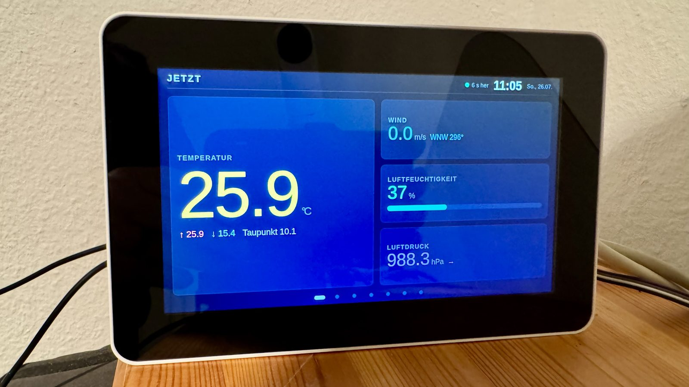
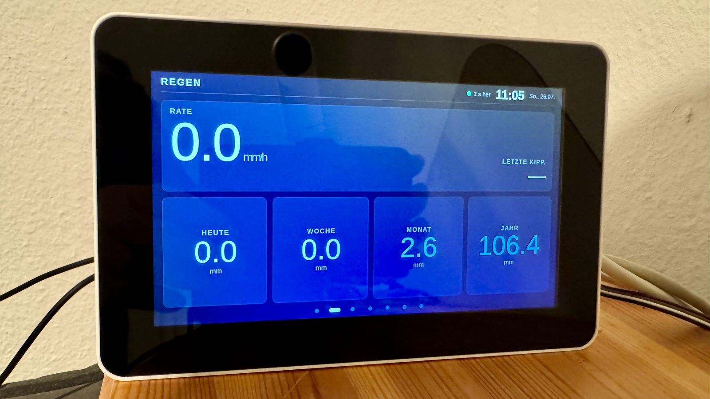
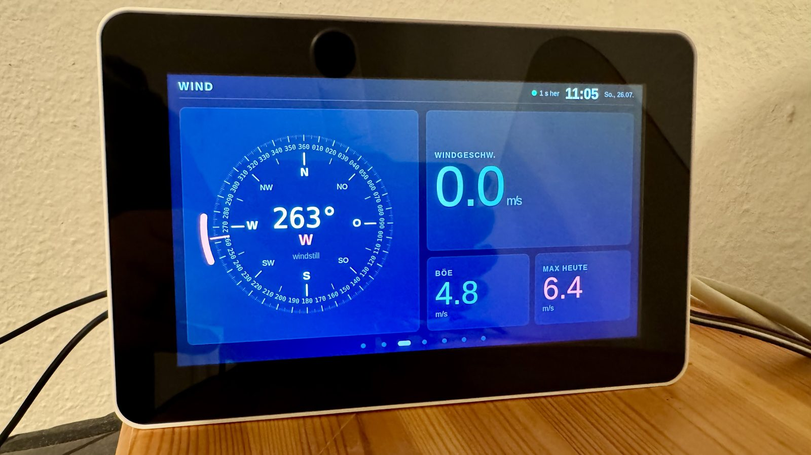
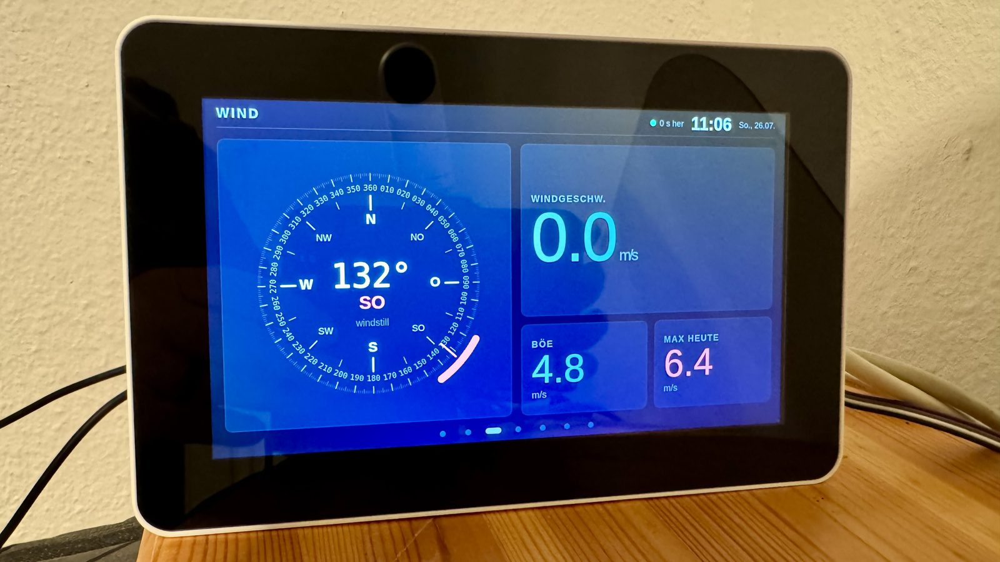
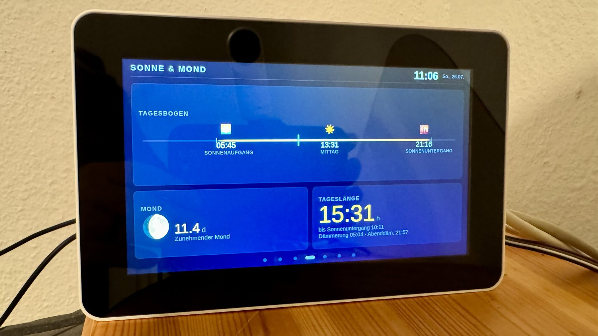
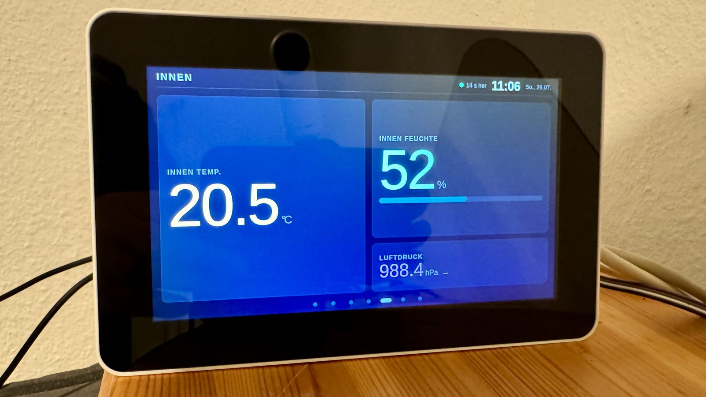
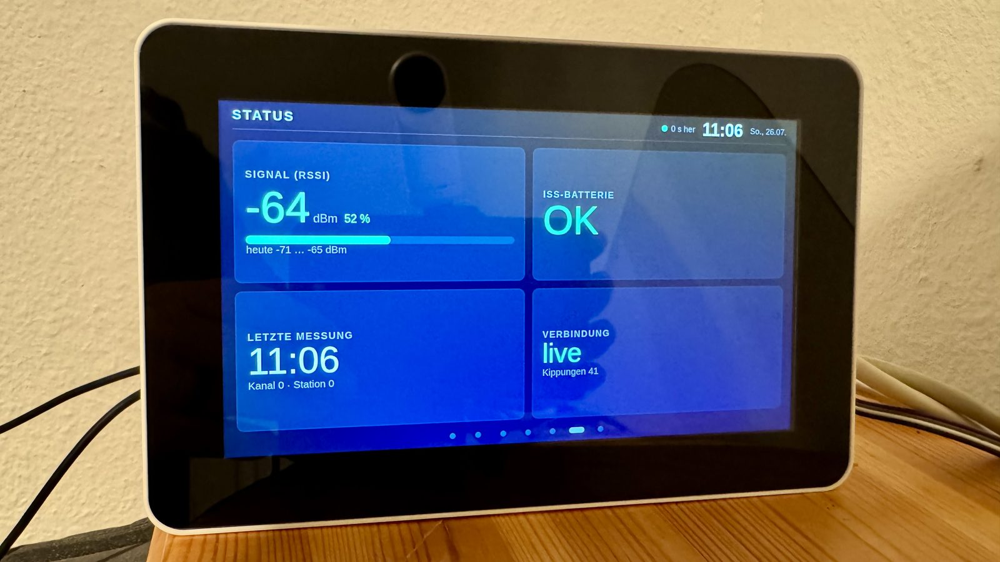
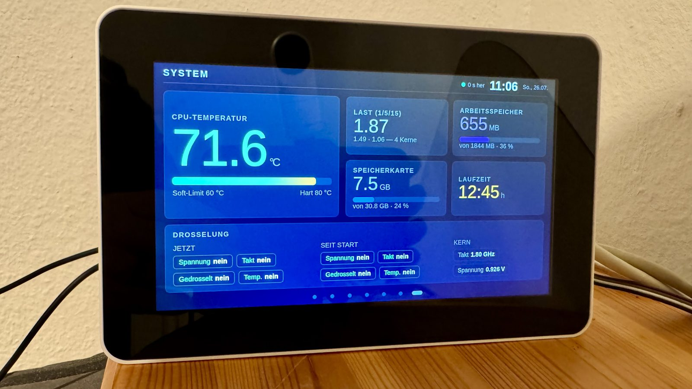

# The touch console

> Photographed 2026-07-26 on the real panel — a Raspberry Pi 4 with a
> 7" Pi Touch Display 2, mounted portrait in a Multicomp case.

A second interface at `/console/`, separate from the browser dashboard. Seven
pages rotate on a 15-second carousel; swiping or tapping a dot takes over for
60 seconds before the rotation resumes.

It runs with **no external dependencies at all** — no Chart.js, no Leaflet, no
CDN, no web fonts. That is not minimalism for its own sake: the panel has to
keep working when the internet does not, and that was verified by pulling the
network port rather than assumed.

## The seven pages

### Now

Outdoor temperature with today's range and dew point, plus wind, humidity and
pressure. The header carries the age of the reading (`6 s her`) — never just a
value without saying how old it is.

### Rain

Rate in mm/h plus totals. `LETZTE KIPP.` shows a dash rather than a time when
the gauge has not tipped — an empty tipping bucket is not a measurement of
zero, it is an absence of one.

### Wind

These two photographs are **61 seconds apart**. The vane swept 131° between
them, at a measured wind speed of 0.0 m/s.

That is the whole argument for how this page is drawn:

* **Three needle states, not two.** Blue when the wind moves, **red for calm**
  (as here — note the `windstill` label), grey when no data has arrived. Without
  the third state a silent station is indistinguishable from a still day. The
  grey state justified itself on the evening it was built, when the station went
  quiet.
* **Calm is defined by the WMO threshold** (10-minute mean ≤ 0.2 m/s), not by
  "the direction stopped changing". These two photographs are exactly why: a
  vane in no wind wanders as readily as it stands still.
* **Two concentric scales.** A single ring cannot carry labels every 10° *and*
  emphasis every 22.5° — 22.5 is never a multiple of 10.
* **North reads `360`, not `000`** — the marine convention.
* **No placeholder values.** Initialising an unknown wind to 0.0 would draw a
  needle claiming "dead calm". The state is shown as unknown instead.

The pointer arc is a **fixed ±13° cursor** around the current bearing. It marks
where the vane is; its width carries no information. A true min/max band was
considered and rejected — as these two photographs show, it would be close to a
full circle most of the time.

> One reading of that swing, from someone who used to steer for a living:
>
> *"Wenn ich das mit der Fregatte gemacht hätte, hätte der Kommandant gesagt
> 'Sie sollen eins-acht-null steuern und nicht Ihren Namen ins Kielwasser
> schreiben!' — und der Smut hätte erbost auf der Matte gestanden, weil unten
> seine Teller allesamt kopheister gegangen sind."*

### Sun and moon

Sunrise, solar noon, sunset, with a tick for the current time, plus moon phase
and day length. The axis on this panel is worth a footnote: it was first drawn
against a hand-made mockup with evenly spaced marks, which looked fine. Real
July times are not evenly spaced — they crowd towards the edges, and the flaw
only became visible on the actual panel.

### Indoor

From a BME280 on the I²C bus. The Davis ISS does not transmit barometric
pressure over the air at all — only the bundled console has it, and that data
never reaches the radio. Hence the extra sensor.

### Status

Signal strength with today's range, ISS battery flag, and the age and channel of
the last packet.

### System

Host health, including the `get_throttled` flags split into *now* and *since
boot* — the distinction matters, and conflating the two once produced a false
alarm.

This photograph accidentally documents a problem. **71.6 °C and a load average
of 1.87**, on an idle-looking weather station. The heat was not the display: it
was a database query. Six API endpoints filtered with
`date(timestamp, 'localtime')`, which cannot use the index, so every request
scanned 3.5 million rows — up to 50 seconds of CPU each.

Measured on the same machine after the fix, later the same day:

| | photographed 11:06 | after the fix |
|---|---|---|
| CPU temperature | 71.6 °C | **56.9 °C** |
| Load average (1 min) | 1.87 | **0.05** |

Nearly fifteen kelvin, from rewriting a `WHERE` clause.

## Related

* Design notes: [`specs/2026-07-25-touch-console-design.md`](specs/2026-07-25-touch-console-design.md)
